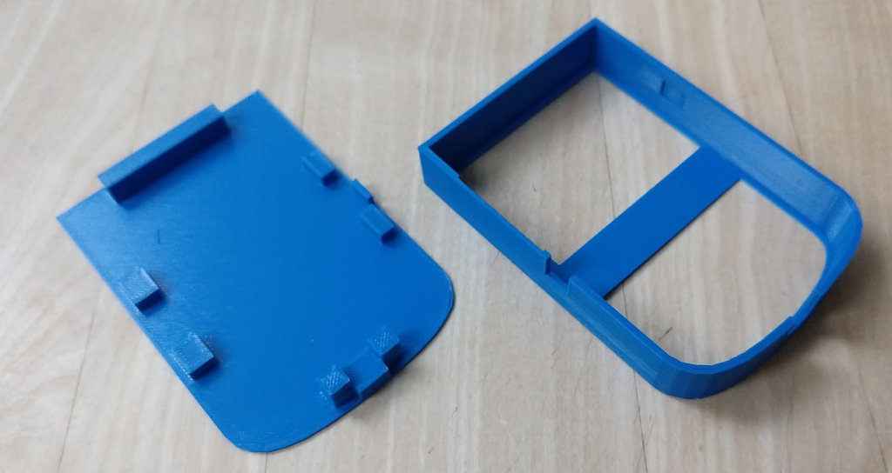
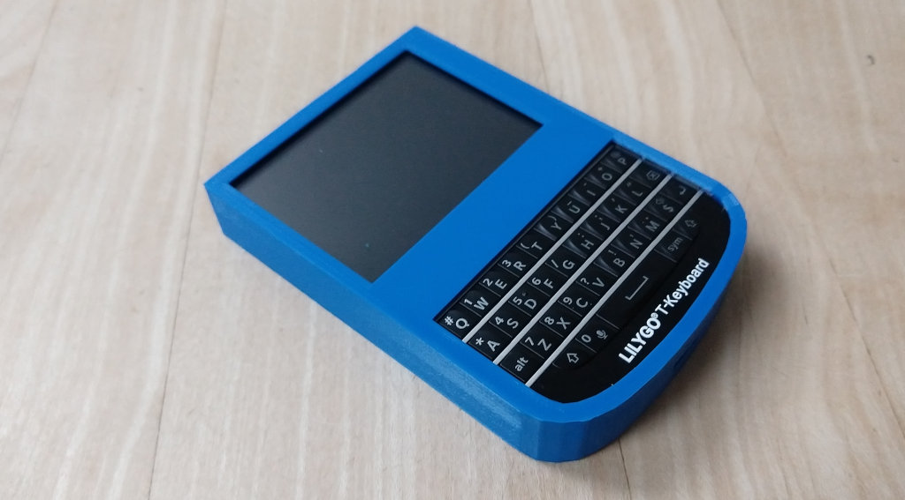

# 3D shell for the T-Deck device

Original design by "James Longfils (loopback7084)", July 2023
[https://www.thingiverse.com/thing:6131064](https://www.thingiverse.com/thing:6131064)

Aug 2023: enhanced by ```christian.tschudin@unibas.ch``` to support the PCB.
The PCB still has some horizontal slack which is easy to remove by adding
a shim at the north side.

Files:
- [enhanced-shell.step](enhanced-shell.step) for modifying e.g., with FreeCAD
- [enhanced-shell.stl](enhanced-shell.stl) for printing e.g., with Cura





---
